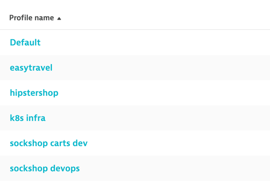
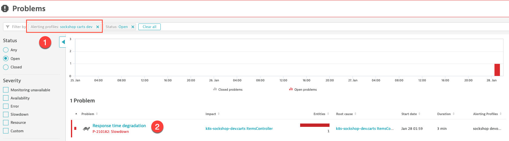
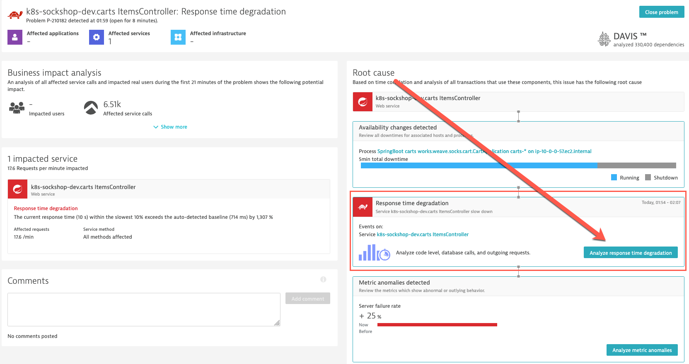
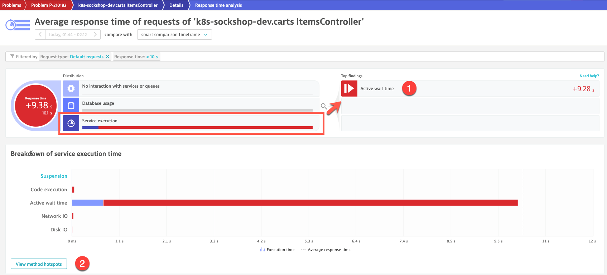
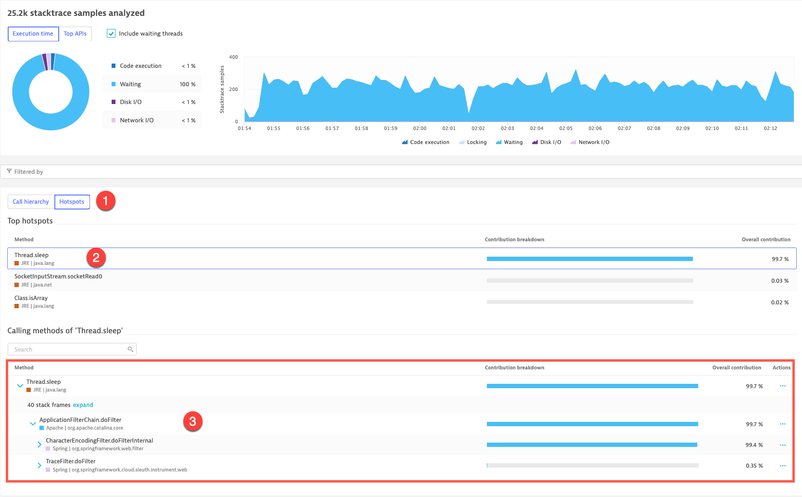

# Fast Track - Instructions and commands only - a few screenshots - minimum details

The detailed version of this workshop, including the narrative and the step-by-step detailed instructions is available here: https://github.com/steve-caron-dynatrace/hot2021-k8s-app-teams 

## Exercise #1 Explore Your Environment

### Dynatrace

<b>Dashboard:</b>

- <b>Menu -> Dashboards -> Dynatrace workshop dashboard template</b>
- Clone the dashboard, give it a name of your choice


### Bastion Host

From the web terminal: 

```sh
$ cd dynatrace-k8s/exercises
```
&nbsp;
## Exercise #2 Set up automatic import of Kubernetes labels and annotations
### Explore metadata in pod definitions

List all the Sock Shop pods running:

```sh
$ kubectl get po -l product=sockshop --all-namespaces 
```

Look at the description of the `carts` pod in the `sockshop-dev` namespace. 

```sh
$ kubectl describe po -l app=carts -n sockshop-dev
```

The OneAgent will use a pod <i>service account</i> to query for this metadata via the Kubernetes REST API.

&nbsp;
### Grant viewer role to service accounts 

<b>No need to execute these commands. It has been done already during the environment bootstrapping.</b>

The service accounts must be granted <b>viewer</b> role in order to have this access.

In the terminal, execute the following command to grant viewer role. This needs to be done for each <b>namespace</b>.

```sh
$ kubectl -n sockshop-production create rolebinding default-view --clusterrole=view --serviceaccount=sockshop-production:default
```

Repeat the procedure for the `sockshop-dev` namespace.

```sh
$ kubectl -n sockshop-dev create rolebinding default-view --clusterrole=view --serviceaccount=sockshop-dev:default
```

### Personal dashboard

- Go to <b>Menu -> Transactions and Services</b>
- In the filter text box <b>(1)</b>, select:
  -  `Tag` `[Kubernetes]product` `sockshop`
  -  `Tag` `[Kubernetes]stage` `prod`
- Click on the edit icon (pencil) next to the screen title (Services). <b>(2)</b> Change the title to: `SockShop Prod services` and click on the check mark to confirm. 
- Click on <b>Pin to dashboard</b> <b>(3)</b>


&nbsp;

## Exercise #3 Custom Service naming rules for Kubernetes

### Service naming rule for Sock Shop

- Go in <b>Settings -> Server-side service monitoring -> Service naming rules</b> and click <b>Add a new rule</b>
- Provide a name to the rule, for example : `Sock Shop service names`
- First, we want this rule to apply only to containerized processes running in Kubernetes. This is done by defining a condition.
  - In the conditions drop-down, select the property `"Kubernetes namespace"` and the condition `"exists"`
  - Click <b>Add condition</b>
  - Select the property `"Process group tags"` and the condition `"equals"`
    - Select the tag `[Kubernetes]product` and the tag value `sockshop`
- For the name format, we can enter free text and/or use placeholders.
  - Placeholders are in between brackets { } to distinguish them from free text
  - Enter this format : 
    - `k8s-{ProcessGroup:KubernetesNamespace}.{ProcessGroup:KubernetesContainerName} {ProcessGroup:Kubernetes:canary} {Service:WebServiceName}`

&nbsp;
## Exercise #4 Playing with Management Zones

### Deploy Hipster Shop

From the web terminal:
```sh
$ ./deploy-hipstershop.sh
```

### Create Management Zone for SockShop

In Dynatrace:
- Go in <b>Settings -> Preferences -> Management Zones</b>. Click <b>Add Management Zones</b>.
- We will start with Sock Shop. Enter a name for the Management Zone : `app:sockshop`
- Click <b>Add new rule</b>

Based on Process groups <b>(1)</b>.
Conditions:: <b>Process Group</b> tag <b>(2)</b>, `product`, auto-imported from a Kubernetes label and of value equal to `sockshop` <b>(3)</b> 


- Click on <b>Preview</b>

- To extend to <b>Services</b>, tick the associated check box. Leave <b>Hosts</b> unchecked.


- Click on the <b>Create rule</b> button.
- <u><b>DON'T FORGET</b> to click on the <b>Save</b> button!</u> 
&nbsp;

### Import the Management Zones via REST API

```sh
$ ./create-management-zones.sh
```


&nbsp;
## Exercise #5 Set up alert notifications

### Import Alerting Profiles via REST API

```sh
$ ./create-alerting-profiles.sh
```


&nbsp;
## Exercise #06 Performance problem detection

### Rollout new build

```sh
$ kubectl apply -f ../sockshop/manifests/scenarios/carts-dev-new-build.yml
```
The <b>carts</b> pod takes about 5 minutes to be ready.

<b><u>TIME FOR A BREAK!</u></b>


&nbsp;

### Problem analysis

<b>Menu -> Problems</b>. You will see a turquoise header offering to try the new problem feed. Click on <b>Try it out</b>.

- <b>(1)</b> Filter by your <b>Alerting profile</b> : `sockshop carts dev`
- <b>(2)</b> Click on `Response time degradation`
&nbsp;

&nbsp;

&nbsp;

&nbsp;


&nbsp;

&nbsp;

### Rollback

```sh
$ kubectl rollout undo deployments carts --to-revision=1 -n sockshop-dev
```
&nbsp;
## Exercise #7 Canary Deployment
### Let's deploy that v2!
<b>From the web terminal:</b>

```sh
$ ./deploy-carts-frontend-v2.sh
```
&nbsp;
### Meanwhile, let's jump to exercise #8
&nbsp;
## Exercise #8 Import Prometheus Metrics

### Deploying carts-db with exporter sidecar and annotation


&nbsp;

But adding the exporter as a sidecar container is not sufficient...


<b>From the web terminal:</b>

```sh
$ kubectl apply -f ../sockshop/manifests/scenarios/carts-db-with-prometheus-exporter.yml
```

```sh
$ kubectl get po -l name=carts-db --all-namespaces -w
```
&nbsp;
### Let's jump back to our SockShop promo
&nbsp;
## Exercise #7 Canary Deployment
### Configure Istio to send traffic to v2

<b>From the web terminal:</b>
```sh
$ ./configure-v1-v2-traffic-management.sh
```
&nbsp;

### Let's keep an eye on v1 vs v2 in our own dashboard
&nbsp;
<b>In Dynatrace:</b>

- Go to the <b>Transactions and Services</b> view
- Find the `k8s-sockshop-production.carts ItemsController` service and drill-down to it
- Click on the <b>View requests</b> button


- In the details view, scroll down to the bottom, in the top contributors you will see `addToCart`. Click on it.
- In the next view, on the top right of the screen, you will see a button with an ellipsis (...), click on it
- Click on <b>Pin to dashboard</b>


- Select your very own perform HOT dashboard.
- In the dashboard, you can place the tiles next to `carts-db write latencies` tile and under the `SockShop Prod services` tile
- Add a nice header tile above it, with a title like : `Carts v1 vs v2`
- Repeat the same steps for the new release of the service : `k8s-sockshop-production.carts v2 ItemsController`.

In the end, it should be something like this:


Don't forget to click the <b>Done</b> button!
&nbsp;
<b>From the web terminal:</b>

```sh
$ ./toggle-sockshop-promo-ff.sh
```
At the prompt, enter <b>1</b>.
&nbsp;

### Meanwhile, back to our carts-db and Mongo Prometheus metrics
&nbsp;
## Exercise #8 Import Prometheus Metrics

<b>In Dynatrace</b>

- Go in the new <b>Metrics</b> view
- In the filter text box, select `Text` and type `mongo`
- The MongoDB Prometheus metrics should be displayed
  - If you don't get anything, wait a bit more, refresh the screen and try again

 

- Remove the filter and this time try with the following : `mongodb_mongod_op_latencies_latency_total`


- Click on <b>Create chart</b>
- The measures displayed are an aggregation of the measure for each of the carts-db pods (dev and production)
  - In the <b>Split by</b> box, select:
    - `Cloud application instance` <b>(1)</b>
    - `Cloud application namespace` <b>(2)</b>
  - In the <b>Filter by</b> box, select: `type: write` <b>(3)</b>
    - The dimension `type` is a <i>Prometheus Label</i> (dimensions are called <i>labels</i> in Prometheus)
    - Selecting `write` will display the write operations latencies
  - Click on <b>Run query</b> <b>(4)</b>

&nbsp;


&nbsp;

- You can play with the chart mode <b>(5)</b> and the type of visualization
- <b>(6)</b> Once done, <b>Pin to dashboard</b>, select your very own personal dashboard, give a name to the chart : `carts-db write latencies`


- Click <b>Open Dashboard</b>

&nbsp;


&nbsp;

### Back to the SockShop promo
&nbsp;
## Exercise #7 Canary Deployment
### Removing the promo feature from the live site
&nbsp;
<b>From the web terminal:</b>

```sh
$ ./toggle-sockshop-promo-ff.sh
```
At the prompt, enter <b>2</b>.
&nbsp;
```sh
$ ./revert-to-v1-traffic-management.sh
```
&nbsp;
## Exercise #9 Managing your workload resource usage

### HipsterShop new paymentservice release
```sh
$ kubectl apply -f ../hipstershop/paymentservice-new.yaml
```
&nbsp;
### EasyTravel new backend release
```sh
$ ./toggle-easytravel-resources-scenario-1.sh
```

At the prompt, enter `1` to enable the scenario.
&nbsp;
### Meanwhile, let's discuss resource management
### A fix for paymentservice
```sh
$ kubectl apply -f ../hipstershop/paymentservice-fix.yaml
```
&nbsp;
### Quota for EasyTravel
```sh
$ kubectl apply -f  ../easytravel/compute-resources-quota.yaml 
```
```sh
$ kubectl delete po -l app=easytravel-backend -n easytravel
```
&nbsp;

### Flooded with problems! Such a perfect day...
&nbsp;


&nbsp;

### Fix the hipstershop paymentservice fix
```sh
$ kubectl apply -f ../hipstershop/paymentservice-fix-the-fix.yaml
```
&nbsp;
### Finally limits for EasyTravel
```sh
$ kubectl apply -f ../easytravel/compute-limitrange.yaml
$ kubectl delete rs -l app=easytravel-backend -n easytravel
$ kubectl get po -n easytravel -w
```
&nbsp;
### That's it for the day - let's remove that backend build
```sh
$ ./toggle-easytravel-resources-scenario-1.sh
```
At the prompt, enter `2` to disable the scenario

:arrow_up_small: [Back to overview](../README.md)
