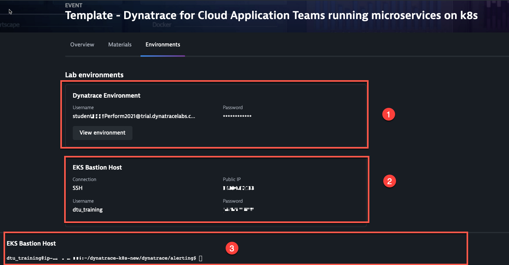
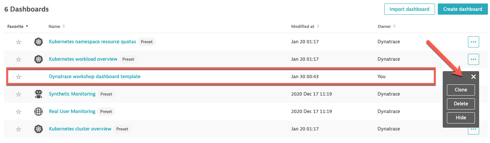
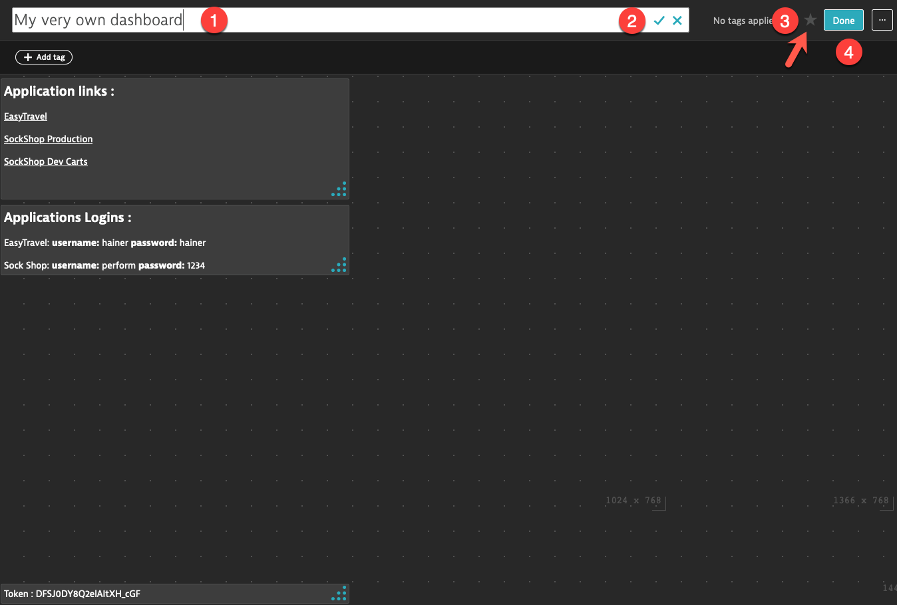
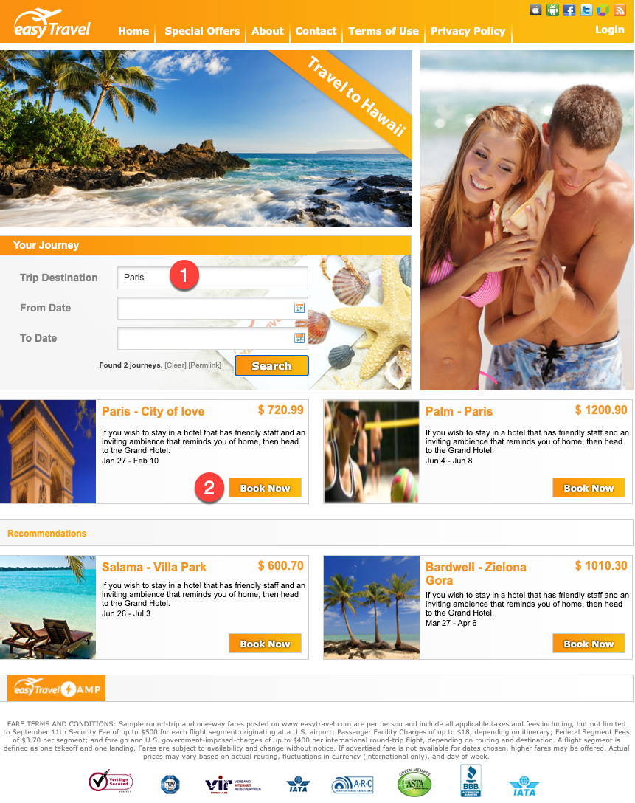
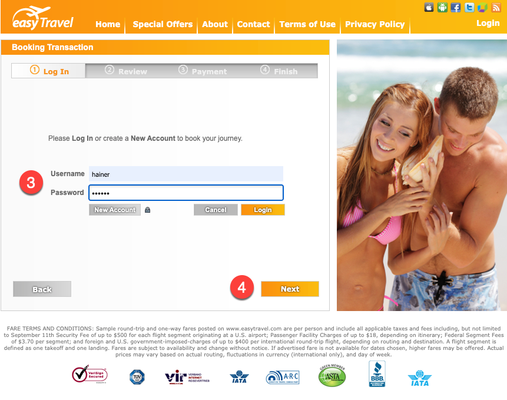
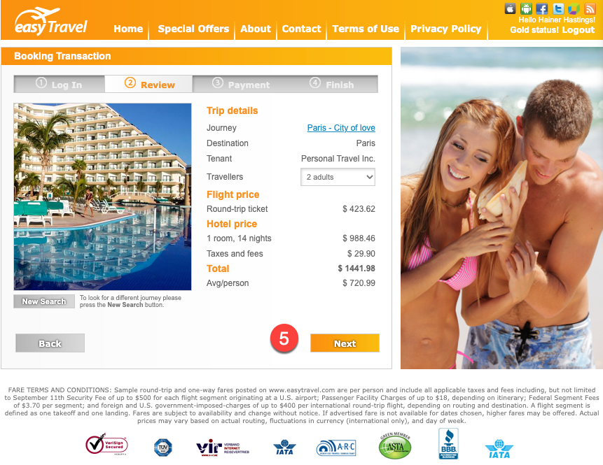
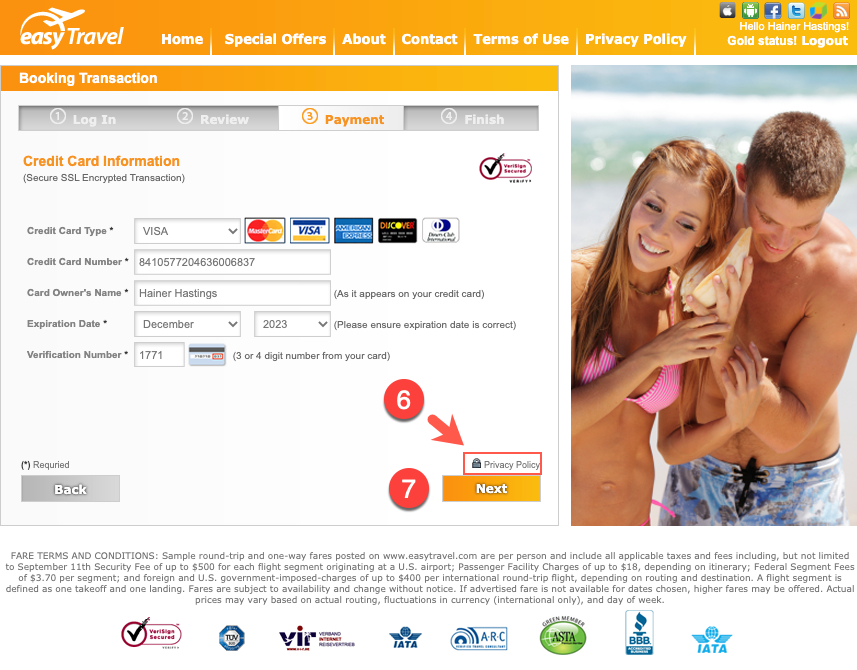
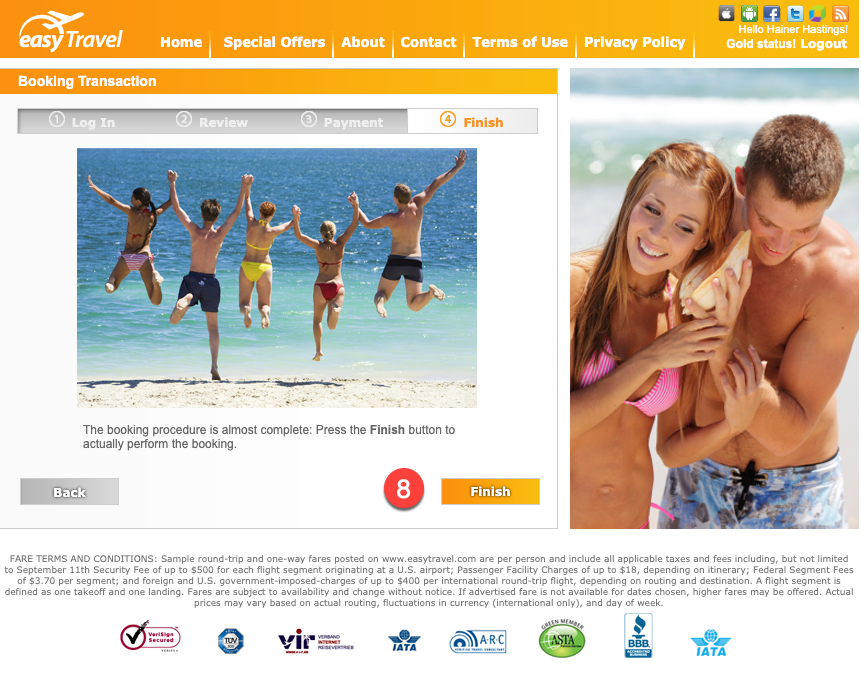
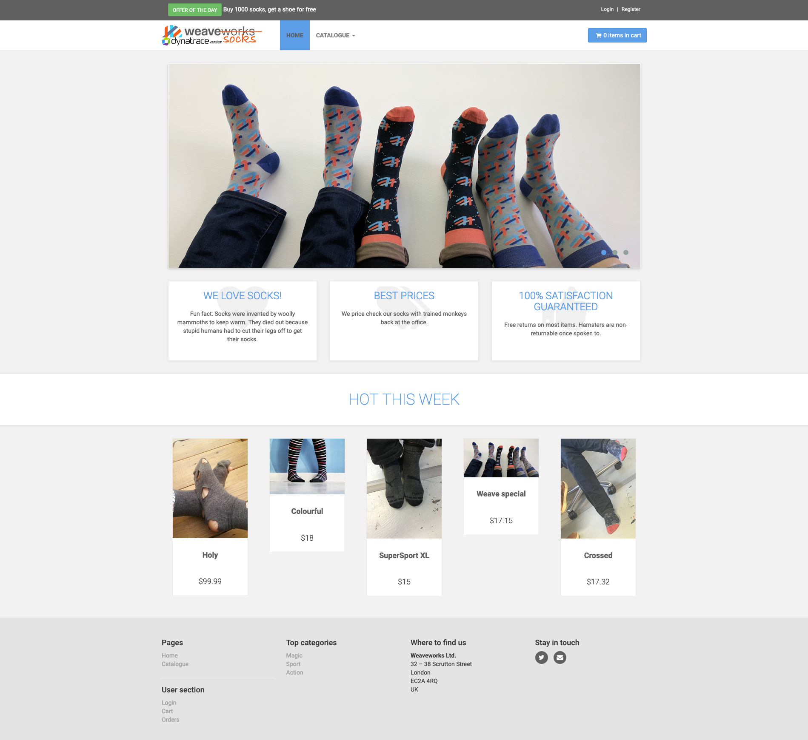

## Exercise #1 Explore Your Environment

### Lab environments

Each of you have access to two environments that you will use for the workshop exercises.

&nbsp;



&nbsp;

1. Your own Dynatrace SaaS tenant. Click on view environment to launch a new browser tab with the login page. Enter the credentials provided.
2. An EKS bastion host providing you a web-based Linux shell terminal to execute scripts associated to your exercises that will essentially:
      - Interact via CLI with your Kubernetes cluster
      - Interact with your Dynatrace environment via REST API
      - Interact with your lab applications

Once you open your terminal <b>(3)</b>, you have access to the prompt. You can slide the divider bar to make the terminal space occupy a larger portion of the screen.  

#### Bastion Host

You don't need to be a shell jockey or a vi expert to complete this class. Unless you run into issues, all you will need is located in a single directory. Once you open the terminal, execute the following command to move to that directory ($ character is only an indicator of a shell command, it's not part of the command itself):

```sh
$ cd dynatrace-k8s/exercises
```

#### Sources

Shell scripts (.sh files), Kubernetes manifests (.yaml/.yml files) and Dynatrace configuration templates (.json) files are also available for viewing on the following Github repo: https://github.com/steve-caron-dynatrace/dynatrace-k8s 

### Your very own Dynatrace dashboard

You will create a dashboard for yourself that will be used throughout this workshop.

- Log in your Dynatrace tenant. 
- At the top of the left menu, click on <b>Dashboards</b>. A list of preset dashboards will be displayed.
- For the dashboard named `Dynatrace workshop dashboard template`, click on the ellipsis (<b>...</b>) button and then <b>Clone</b>.



This makes a copy of the dashboard template that is your own and that you can edit.

- Next the to dashboard title `Dynatrace workshop dashboard template - cloned`, click the edit (pencil) icon.
- Enter a new title of your choice <b>(1)</b>, for example `My very own dashboard`.
- Click on the check mark to confirm the change <b>(2)</b>.
- Click on the star icon to add the dashboard to your favorites <b>(3)</b>
- Click on the <b>Done</b> button to save your changes <b>(4)</b>.



The dashboard also contains the following information:

- Link to your EasyTravel home page
- Link to your SockShop production home page
- Dynatrace API token. You should not need this except for troubleshooting purposes

### HaveFunCompany applications

#### EasyTravel

EasyTravel has been HaveFun Company flagship application for a long time but it is now due for an overhaul in order for it to stay competitive. It evolved from a monolith app to a 3-tiers app (frontend-backend/app-server/database) and later a tentative migration to SOA, which was never fully achieved. 

The latest decisions have been to progressively re-architecture it to microservices. The first step was to lift and shift it to containers and run it in our Kubernetes cluster.

Play around! You can run some transactions from the browser (click on the link from `your very own dashboard`). 







&nbsp;

#### Sock Shop

The board of HaveFunCompany have mandated the executives to diversify the business activities. Researches from the marketing and business development departments have concluded that the "online sock apparel retail business" is up for grabs. 

&nbsp;


&nbsp;

Anyway... the outcomes of this is the Sock Shop project. The company hired the best architects and developers to build the ecommerce web site using the latest trends and technologies. 

Of course, the CIO decided that it <i>has</i> to be cloud-native and run on Kubernetes. You have been transferred from EasyTravel to Sock Shop and named the application lead, with the responsibility to make this new business technically successful.

- An important factor in the success of cloud-native and microservices initiatives is the ability to get <i>observability</i>. 
- You have been using Dynatrace to provide 360 degrees insights on EasyTravel, the company flagship application. But EasyTravel is a monolithic app that has only been recently lifted and shifted to run in containers.
- Sock Shop is a very different beast. It's designed to be cloud-native. Your Dynatrace account exec told you Dynatrace works with cloud-native. Well, it's time to give it a shot! :metal:

Let's first get a bit more familiar with the Sock Shop application.

Load the Sock Shop app page in your browser (from the link available in your very own dashboard).



Play around! 

Run some transactions from the browser (Register, Logout, Login, Catalogue, Add to Cart, etc).

You can manually register a new account or log in with one that was created during the previous step:

`username : perform`

`password : 1234`

<b><u>NOTE</u></b>: The checkout service in the application is not currently implemented. You can add items to the shopping cart but you will not be able to checkout.

---

 :arrow_forward: [Next : #2 Import Kubernetes Labels and Annotations](../02_Import_k8s_labels_annotations/README.md)

:arrow_up_small: [Back to overview](../README.md)
