## Exercise #2 Rearchitecturing the EasyTravel app

### Scenario

In our first scenario, we are working on a legacy app from HaveFunCompany. The application is named EasyTravel. It evolved from a monolith app to a 3-tiers app (frontend-backend/app-server/database) and later a tentative migration to SOA, which was never fully achieved. 

EasyTravel has been your company flagship application for a long time but it is now due for an overhaul in order for it to stay competitive. 

The lastest decisions have been to progressively re-architecture it to microservices. The first step was to lift and shift it to containers and run it in our Kubernetes cluster.

Here is the current architecture, how can you break it down into microservices? How can you identify the services. Can Dynatrace help?

### Observability as an architecturing tool

In order to rearchitecture a legacy application, you need to understand its business logic. How the different packages, classes, services interact with each other.

Dynatrace grants you full visibility into your applications. Combining transaction tracing and code-level visibiblity is powerful.

You will start in the Kubernetes view: <b>Menu -> Kubernetes</b>, where you have a overall view of your cluster, in terms of infrastructure (nodes), cluster events and applications (workloads).

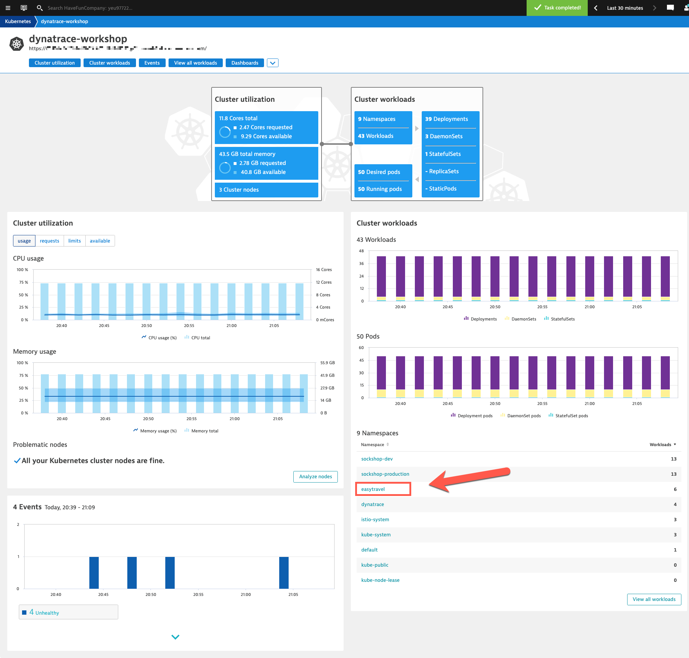

Since we will be working on EasyTravel, drill-down to the `easytravel` namespace. Dynatrace displays the "Cloud Applications" view, or more exactly the different type of workloads in the `easytravel` namespace, which are all Kubernetes <i>Deployments</i>, their resource usage, number of pods and their associated <i>Services</i>.

We will look at the Dynatrace entry points, the web server pods. 

- Find the `easytravel-www` workload
- Click on <b>2 services</b> (the far right column). 

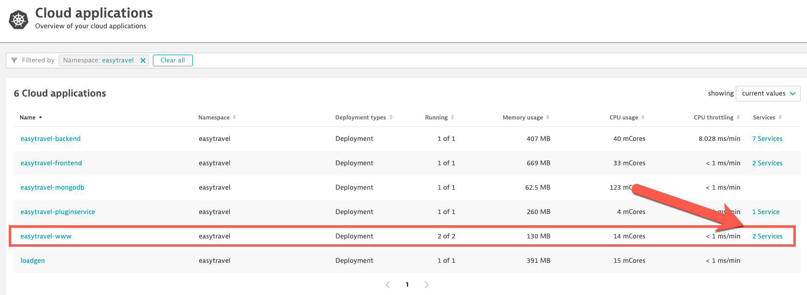

This will display 2 services automatically discovered by Dynatrace. There's one for each nginx <i>server block</i> (port 80 and port 8080). Our app is served via HTTP - port 80 ( not very secure, I know :scream: :scream: :scream: ). Drill-down the `:80` service.

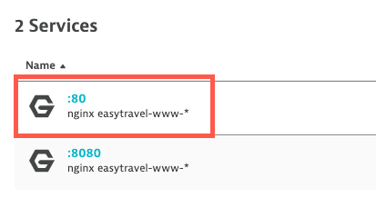

Here you have the <b>Service</b> view. The infographic shows the <Applications> and <Services> calling this service and which other <Services> it is calling. 

- We also see <b>(1)</b> that this service is currently implemented by 2 pod replicas. 
- Click on the <i>Service Flow</i> button <b>(2)</b>

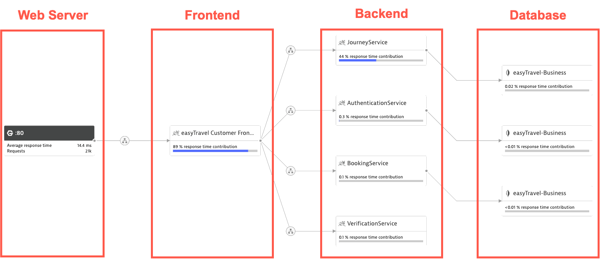

This shows the distributed transaction tracing from the current service accross the downstream services, down to the backend. This view allows you to get a better understanding of the service dependencies, how much time is spent in each of the services, the number of requests. We can clearly see the legacy architecture here: web server -> frontend -> backend -> database.

Dynatrace also automatically detected backend web services such as the `JourneyService`, the `AuthenticationService`, the `Booking Service` and the `VerificationService`. Those are excellent candidates for microservices to be decoupled from the backend pod and run in their own pods.

Currently, the company has projects to provide better and smarter destination search capabilities. This is currently impletemented in JourneyService. You want to decouple the destination search from the rest of the JourneyService implementation so it can be developed, tested and released at an accelerated pace. You also want it to scale out demand without having to scale everything else from the JourneyService.

How to identify the breaking point? It would also be nice to understand the impact before starting to make code changes, to make sure the right implementation decisions will be made.

- In the <b>Service Flow</b>, select the <b>JourneyService</b> and click on the ellipsis <b>(...)</b> button, then drill-down to <b>Method Hotspots</b>. 

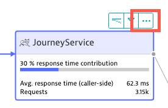

This leads you to the <b>Method Hotspots</b> view for the `JourneyService`. This view provides deep dive code-level visibility; method call stack, where time is spent in the code and what is the nature of consumption time (code execution, waiting time, thread locking, network I/O).

Method hotspots <b>Call hierarchy</b> view will show Many of those methods are from classes that are not necessarily your own code. Those can be framework libraries or 3rd party libraries. Your code is in the `com.dynatrace.easytravel` package, you can search for it!

- In the <b>Search</b> text box, enter `easytravel`
- Dynatrace leads you to the `findJourneys` and the `findLocations` methods from the `business.webservice.JourneyService` class.
- These methods look like good candidates for microservices! 

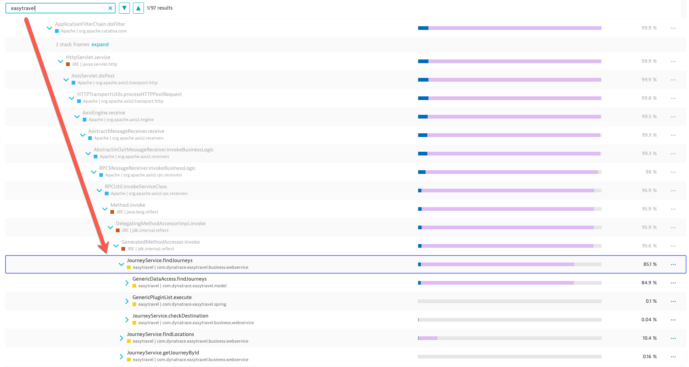

Method `findJourneys` is the one consuming most of the resources. The code it runs also corresponds to the "destination search" capability that the company wants to improve.

Before starting to break down `JourneyServices` and make codes changes, it is important to understand the consequences. How this will affect the transaction flows. Also, true microservices have their own data store, which means you will have to understand the kind of database transactions `JourneyServices` is doing, what the new `findJourneys` will do instead, etc

Dynatrace can help to get a better understanding, without even have you change any of your code! For that, we will artifically change the <b>Service Flow</b> model to simulate the new microservice, using a <i>Custom Service</i>.

Before we define our Custom Service, we will want to make sure a setting is enabled.

- Go in the menu <b>Seetings -> Server-side service monitoring -> Deep monitoring -> Real-time updates to Java and PHP services</b>
- Make sure real time updates to Java services is enabled

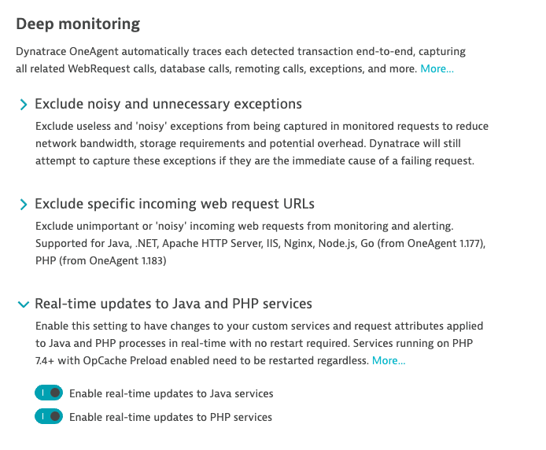

<b>Custom Services</b> are defined by rules specifying where in the code execution you want Dynatrace to consider a new service is called.

- In the menu, go to <b>Settings -> Server-side service monitoring< -> Custom Service Detection </b> 
- Select the <b>Java services</b> tab and click on the <b>Define Java services</b> button
- Enter a name for your custom service. Thix can be any name of your choice, we will use : `findJourneyServices`
- Click on the <b>Find entry point</b>

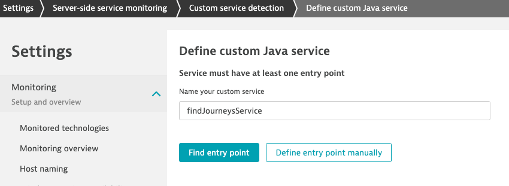

- Select <b>Process Group</b> : `tomcat easytravel-backend-*` (you can type "backend" and it will find it for you)
- Select the process that will show up in the list
- Click on <b>Continue</b>

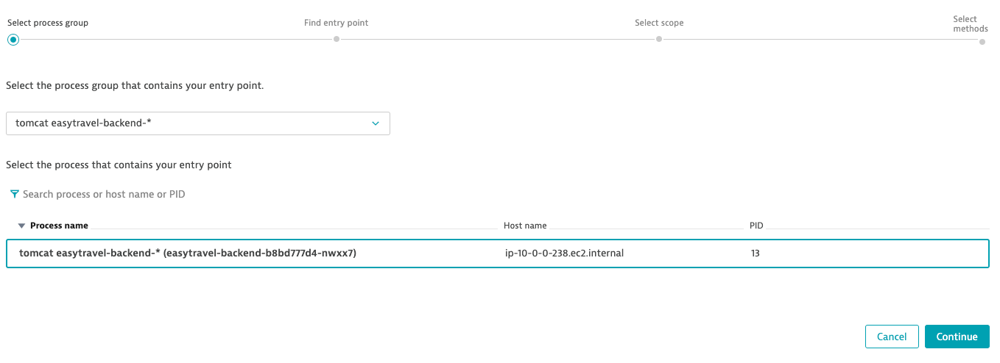

You need to enter the class name of the method that you want to use as the service entry point. This does not have to be the full name but the more accurate you are the better. Referring back to the <b>Method Hotspots</b> view, the class was named `com.dynatrace.easytravel.business.webservice.JourneyService`.

- <b>(1)</b> Enter `business.webservice` in the text box. 
- <b>(2)</b> Click on <b>Search</b>.
- 12 classes will be found, all from the `business.webservice` library.
- <b>(3)</b> Select the `JourneyService` class
- <b>(4)</b> Click on <b>Continue</b>

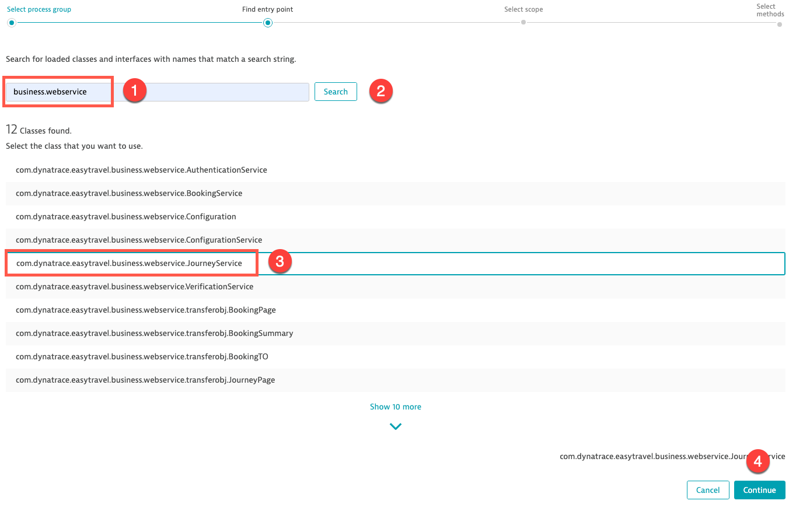

On the next step (<b>Select scope</b>), leave it to the default selection, click <b>Continue</b>.

The search will display a list of methods provided by the `JourneyService` class. The method we are interested about (again from our analysis in <b>Method Hotspots</b>) is `findJourneys`. 

- <b>(1)</b> Select `findJourneys`. Note that you could select multiple methods if you want all of them to be considered at entry points for the custom service. Here we only want `findJourneys`.
- <b>(2)</b> Click the <b>Finish button</b> (bottom right).

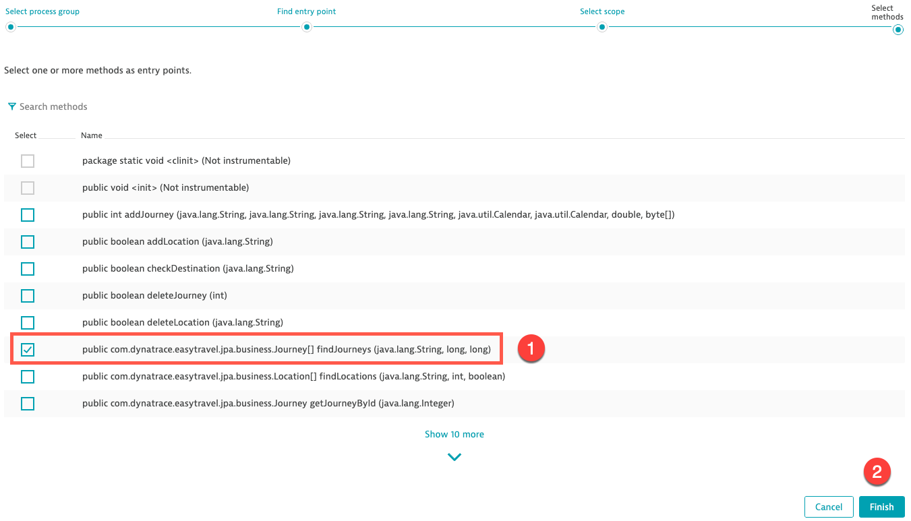

Now you have your Custom Service detection rule ready. Click the <b>Save changes</b> button.

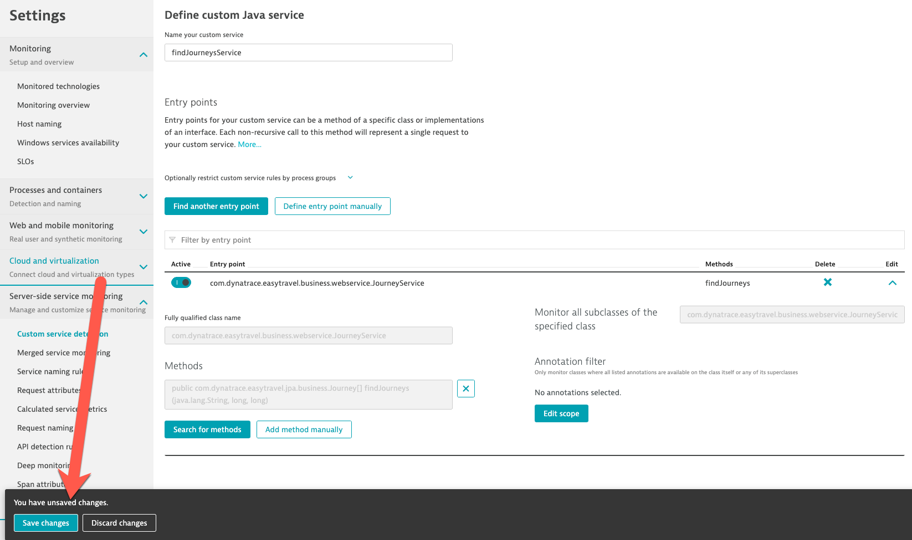

Your rule is now active and pushed to the Dynatrace OneAgents. 
And because this is Java and we have <b>Real-time updates to Java services</b> enabled, this change is immediatly active. No JVM restart needed.

Wait a few minutes to give Dynatrace the time to capture data

Go back to the `easytravel-www` <b>Service Flow</b>

We now see the `findJourneysService` - and we can also see how it interacts with the MongoDB datastore. 

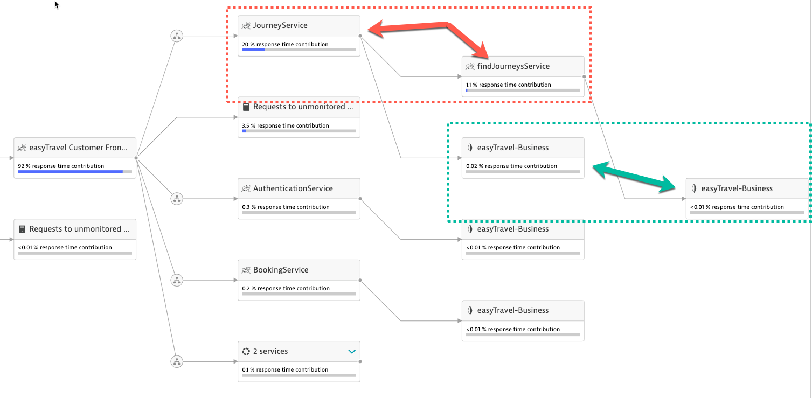

Undertanding what type of operations on which documents in MongoDb are being performed by `findJourneysService` is of tremendous help to redesign the data domains for both the new microservice and the remaining `JourneyService` 

- In the Service Flow, select the `easytravel-Business` that is connected to `findJourneysService`, and click on the Statements icon.

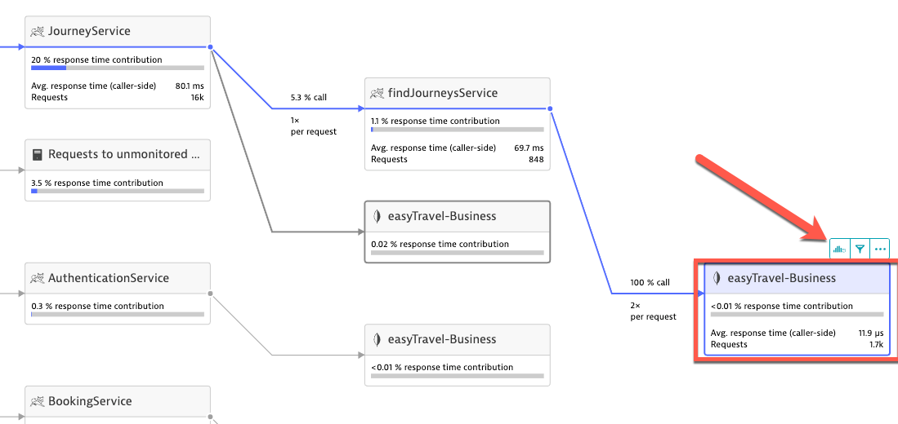


So that's it.


## Access the Sock Shop web app

The application deployment created a <b>Service</b> resource of type <b>Load Balancer</b> to expose the <b>front-end</b> and <b>carts</b> services to the public internet. It might take a few minutes before the public IPs become available.
You can obtain the app URLs by running this script:

```sh
$ ./get-sockshop-urls.sh
```
The script will wait until the IPs are available and will then print those. 


Click on the Production or Dev frontend URL to load the Sock Shop home page.

The URLs are stored in the `configs.txt` file. You can always get those by running this command (from the current directory):

```sh
$ cat configs.txt
```

## Create Sock Shop user accounts

This following script will create a few user accounts that will be used by the synthetic monitors to generate traffic on the Production environment:

```sh
$ ./create-sockshop-accounts.sh
```

## Explore the app

Load the Sock Shop app page in your browser.


Play around! 

Run some transactions from the browser (Register, Logout, Login, Catalogue, Add to Cart, etc).

You can manually register a new account or log in with one that was created during the previous step:

`username : perform`

`password : 1234`

<b><u>NOTE</u></b>: The checkout service in the application is not ]]]currently implemented. You can add items to the shopping cart but you will not be able to checkout.

---

:arrow_forward: [Next : #2 Deploy the OneAgent Operator](../02_Deploy_OneAgent_Operator)

:arrow_up_small: [Back to overview](../)
