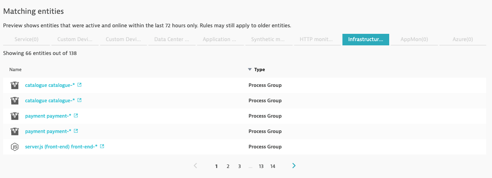
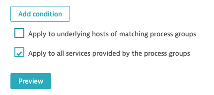
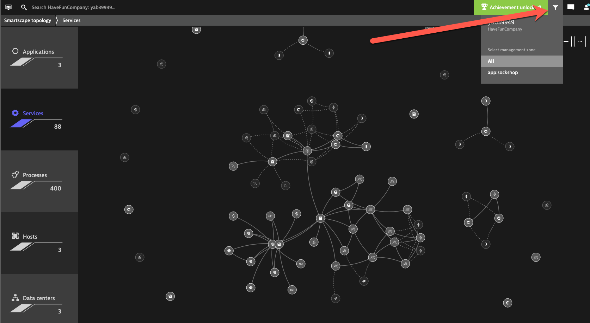
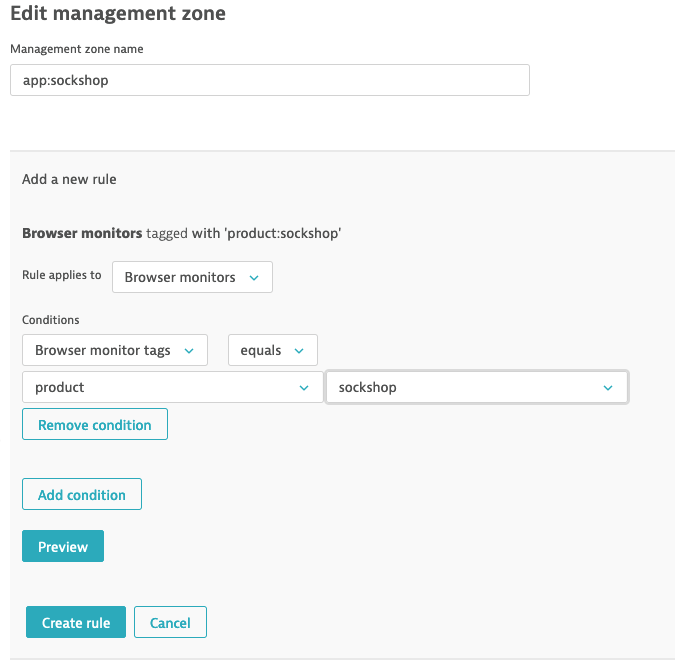
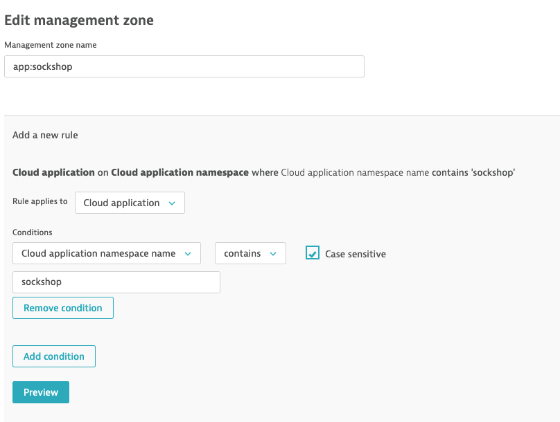
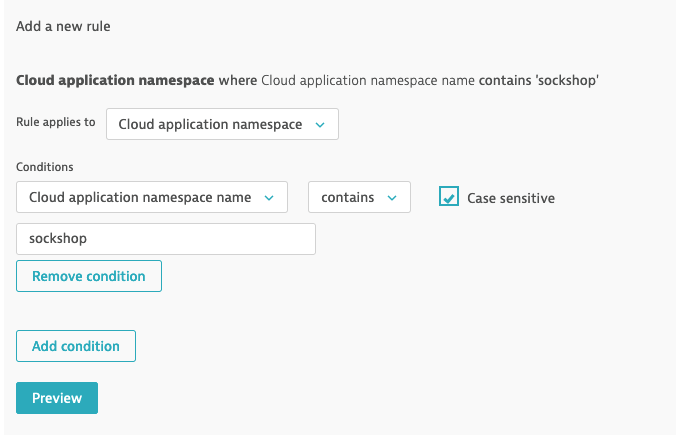
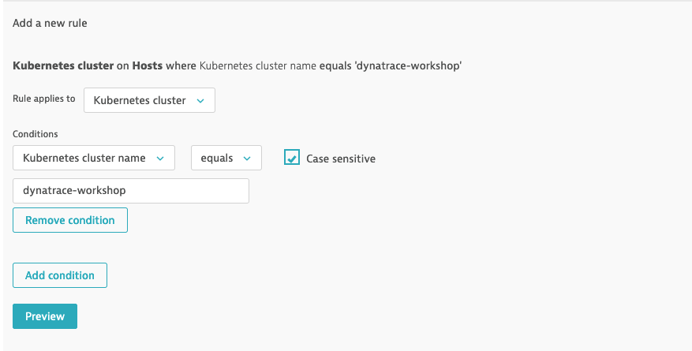
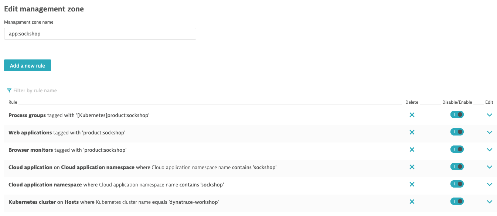
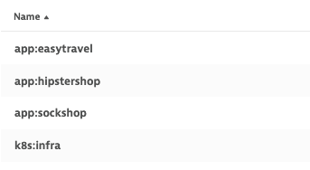

## Exercise #4 Playing with Management Zones

### We're growing, we're hiring!

The company is growing. It recently acquired another company called HipsterShop. They have their own app already in microservices and running in Kubernetes. In order to have everything in one single pane of glass, the business decided to onboard HipsterShop on Dynatrace.

The HipsterShop acquisition is a significant financial investment. It's getting a lot of board and executive eyeballs, schedules are tights and margin of errors are low. You can't afford much resources and time but you need the visibility in order to migrate the app succesfully and get the most value out of it.

Luckily, you have Dynatrace.

### Deploy a new application

Go in the web terminal (be sure you are in the `exercises` directory), execute:

```sh
$ ./deploy-hipstershop.sh
```
HipsterShop is now deployed on your Kubernetes cluster.

Now, one of the challenges you have is figuring out all the data you have in Dynatrace. 

- There are 3 different apps 
- In different delivery stages
- With a potentially growing infrastructure and number of services. 

When you look into the different Dynatrace views, how can you figure out what is what?

We have seen how we can leverage the labels defined in Kubernetes as tags in Dynatrace. We have also seen how we can rename services and other entities so they fit to our naming convention.

Also, each microservice team wants to focus on their own things. They are not interested in the other business units and the company does not necessarily want to grant full access to everyone but would instead rather apply a principle of least privileges.

### Create Management Zones based on process property

We want to be able to easily segregate views of <b>EasyTravel</b>, <b>SockShop</b> and <b>HipsterShop</b>. This is done by leveraging <b>Management Zones</b>. 

The `product` tag (based on the pod label) is a good candidate as a condition for the <b>Management Zone</b> rule.

- Go in <b>Settings -> Preferences -> Management Zones</b>. Click <b>Add Management Zones</b>.
- We will start with Sock Shop. Enter a name for the Management Zone : `app:sockshop`
- Click <b>Add new rule</b>


### Configure Management Zone rules

The rule will be based on Process groups <b>(1)</b>. 
- <u>Note</u>: It would also be valid to base it on Services.

The condition is based on a <b>Process Group</b> tag <b>(2)</b>, `product`, auto-imported from a Kubernetes label and of value equal to `sockshop` <b>(3)</b> 


### Preview Management Zone rule

- Click on <b>Preview</b>
  
Preview shows the <b>Management Zone</b> will only apply to <b>Process Groups</b> and <b>Processes</b>. This is normal, this is how we had it defined.



### Extending Management Zone rule

The Management Zone rule can be extended to underlying <b>Hosts</b> (nodes) and to <b>Services</b> associated to the <b>Process Groups</b>. This depends on the scoping you want. 

For example, you might want to provide <b>Process</b> and <b>Services</b> visibility to the application development teams but no access to the underlying infrastructure data, which is a shared infrastructure with other projects and business units in the company.

This is what we will do.

- To extend to <b>Services</b>, tick the associated check box. Leave <b>Hosts</b> unchecked.



- Click on <b>Preview</b>

You now see the <b>Management Zone</b> will apply to <b>Services</b> and infrastructure entities such as <b>Process</b> and <b>Process Groups</b> but <b>Hosts</b> are not included.


&nbsp;

- Click on the <b>Create rule</b> button.
- <u><b>DON'T FORGET</b> to click on the <b>Save</b> button!</u> 

&nbsp;

### Validate in Dynatrace

- Navigate in the different dashboards
- You will see a funnel icon appear in the top menu bar
- Clicking on this button will list the available <b>Management Zones</b> 

&nbsp;



&nbsp;

- Select a <b>Management Zone</b> and navigate to the <b>Services</b> and <b>Technologies</b> views. Notice the difference, the lists are filtered according to the selected zone.

You might have noticed that the <b>Applications</b> and <b>Synthetic Monitors</b> are not part of the defined <b>Management Zones</b>. 

- This is normal. <b>Applications</b> and <b>Synthetic Monitors</b> do not inherit auto-tags from <b>Services</b>, <b>Process Groups</b> or <b>Hosts</b>. 
- They need their own tags to be defined and a corresponding <b>Management Zone rule</b> to be added.

The <b>Kubernetes</b> view will also be empty.

- Again, this is normal. The Management Zone we created for Sock Shop currently applies only for two entity types: <b>Services</b> and <b>Process/Process Groups</b>. To provide visibility on the Kubernetes workloads (aka <b>Cloud Applications</b>), we need to add rules for that in the `app:sockshop` Management Zone.

### ***Optional*** Add the missing rules for `app:sockshop` Management Zone

This part is optional. If you want to do it manually in the Dynatrace console, the instructions are below. But there is a certain amount of repetitive clicking involved... :unamused:

Otherwise you can skip this section and go to the next section where you will automtically import the Management Zone rules using a script... :muscle:

- Go back to the Management Zones configuration screen : Menu -> <b>Settings -> Preferences -> Management Zones</b>
- Edit the `app:sockshop` Management Zone
- Add the following rule so that the EasyTravel Web Application is now in the scope of the Management Zone
  - Rule applies to : `Web applications`
  - Conditions : `Web application tags` `equals` `product` `sockshop`
  - <u><b>DON'T FORGET</b> to click on <b>Create rule</b> and then on the <b>Save</b> button!</u> 


- Edit the `app:sockshop` Management Zone
- Add the following rule to include the <b>Synthetic Monitors</b> in the scope of the Management Zone.
  - Rule applies to : `Browser monitors`
  - Conditions : `Web application tags` `equals` `product` `sockshop`
  - <u><b>DON'T FORGET</b> to click on <b>Create rule</b> and then on the <b>Save</b> button!</u> 



- Edit the `app:sockshop` Management Zone
- Add the following rule to include the easytravel <b>Cloud Applications</b> in the scope of the Management Zone.
  - Rule applies to : `Cloud application`
  - Conditions : `Cloud application namespace name` `contains` `sockshop`
  - <u><b>DON'T FORGET</b> to click on <b>Create rule</b> and then on the <b>Save</b> button!</u> 



- Edit the `app:sockshop` Management Zone
- Add the following rule to include the easytravel <b>Cloud Application Namespace</b> in the scope of the Management Zone.
  - Rule applies to : `Cloud application`
  - Conditions : `Cloud application namespace name` `contains` `sockshop`
  - <u><b>DON'T FORGET</b> to click on <b>Create rule</b> and then on the <b>Save</b> button!</u> 



- Edit the `app:sockshop` Management Zone
- Add the following rule to include the <b>Kubernetes cluster</b> in the scope of the Management Zone.
  - Rule applies to : `Kubernetes cluster`
  - Conditions : `Kubernetes cluster` `equals` `dynatrace-workshop`
  - <u><b>DON'T FORGET</b> to click on <b>Create rule</b> and then on the <b>Save</b> button!</u> 



That's it... phew!! :sweat_smile:

The finalized Management Zone will look like this:



Now repeat the same steps for EasyTravel and Hipster Shop!!! :exploding_head: :exploding_head: :exploding_head:

Just kidding. In the next section, we will import those Management Zone rules via a script.

### Management Zones for EasyTravel, Hipster Shop and the Kubernetes cluster infra team

Because Dynatrace provides full-stack visiblity on your Kubernetes environment, it is typically not only leveraged by application teams but also other platform teams who are more interested in the platform underlying infrastructure visibility.

We want a Management Zone just for that.

We also need Management Zones for the other apps: EasyTravel and HipsterShop.

...and we might not have completed the Sock Shop Management Zone configuration via the console. :sleeping:

No worry!!! 

Dynatrace provides a rich REST API that can be used, among other things, to automate configuration. 

And we have a script that will use the API to save time and create the Management Zones for you! :sunglasses:

In the web terminal, make sure you are in the `exercises` directory:

```sh
$ ./create-management-zones.sh
```
Et voilà! :v:

You can validate in the console that the 4 management zones are created (refresh the page)




### Validate in Dynatrace

Now it's time to see the results.

- Navigate in the different dashboards
- Select one of the app <b>Management Zones</b> (funnel icon, top right) and navigate to the <b>Transactions and Services</b> and <b>Technologies</b> views. 
- Navigate to the <b>Hosts</b> view (nothing).
- Navigate to <b>Applications</b> and <b>Synthetic</b> views.
- Go to the <b>Kubernetes</b> view.

Switch to the `k8s:infra` Management Zone and navigate to the same screens. See the difference?

We won't configure Role-Based-Access-Control enforced by Management Zones. This is a bit of the scope of the workshop. But rest assured, knowing that you have done the heavy lifting. Configuring RBAC for Management Zones is only a few more clicks.

---

[Previous : #3 : Customize Service Naming](../03_Customize_Service_naming/README.md) :arrow_backward: :arrow_forward: [Next : #5 : Set up Alerting Profiles](../05_Set_up_Alerting_Profiles/README.md)

:arrow_up_small: [Back to overview](../README.md)