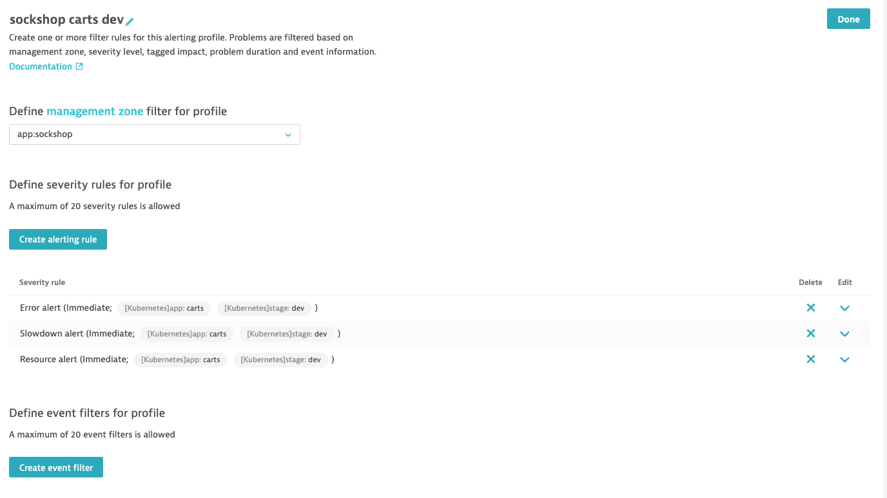

# Exercise #5 Set up alert notifications

<u>Scenario:</u> 

The Kubernetes platform admin team works with different tools and they want to receive their alert notifications by email.

On the other hand, the teams in charge of development and support/ops of the Sock Shop services use a chatops tool such as Slack. There are specific Slack channels for each service and also channels for dev and channels for support/ops.

For example: 

- the Sock Shop `carts` dev team only want to receive alerts related to the <b>carts</b> service running in <b>dev</b> on their Slack channel
  - they don't want to receive anything related to <b>production</b> on that channel
- the "carts support/ops team" only want to receive <b>production</b> related alerts on their channel and only those involving the <b>carts</b> service
- both teams are using the Kubernetes platform but they are not in charge of it; this is the platform admin team who does that
  - in consequence, they don't want to receive infrastructure-only related alerts

## Sock Shop carts service dev team

### Create an Alerting Profile for the carts service dev team

- In the menu, go in <i>Settings -> Alerting -> Alerting profiles</i>
- Create a new profile named : `sockshop carts dev`
- In the <b>Define management zone filter for profile</b> select `app:sockshop`
- The dev team environment have their apps running under tests. 
  - The test environments are not always up. 
  - So they're not concerned by availability. 
  - Their concerns are performance, errors and resource utilization
- So remove <b>Severity Rules</b> to only keep:
  - Error alert
  - Slowdown alert
  - Resource alert
- We need to add filter to only scope the carts service. For each of those <b>Severity rules</b>, do:
  - Expand the rule
  - Set the <b>Send notification if a problem remains open longer than</b> to `0  minutes`
  - From <b>Filter problems by tag</b>, select `Only include entities that have all tags`
  - Click <b>Create tag filter</b>
  - Select tag : `[Kubernetes]app:carts`
  - Click <b>Create tag filter</b>
  - Select tag : `[Kubernetes]stage:dev`
  - Click <b>Save</b>
- Once you have done all 3 rules, your <b>Alerting Profile</b> configuration should like below: 

&nbsp;

## Kubernetes platform admin team

### Create an Alerting Profile for the Kubernetes platform admin team

- In the menu, go in <i>Settings -> Alerting -> Alerting profiles</i>
- Create a new profile named : `k8s infra`
- In the <b>Define management zone filter for profile</b> select `[Kubernetes] My HOT k8s cluster`
- Expand the <b>Resource alert</b> Severity Rule. Set the <b>Send notification if a problem remains open longer than</b> to `5 minutes`. Click <b>Save</b>

    

- That's it! You can click <b>Done</b>
  - Because the selected <b>Management Zone</b> already filter for only <b>Hosts</b> and <b>Process Groups</b> part of the Kubernetes cluster and we removed the <b>Services</b> entities from the <b>Management Zone</b> definition, this <b>Alerting Profile</b> will result in only sending alerts related to Kubernetes cluster infrastructure (hosts/nodes + processes/containers)

### Create a Problem Notification mechanism for the Kubernetes platform admin team

You will set up problem notification to send emails to the Kubernetes platform admin team.

- In the menu, go in <i>Settings -> Integrations -> Problem notifications</i> 
- Click on <b>Set up notifications</b> 
- Select <b>Email</b>

    

- Enter a name of your choice for the setting
- Enter an email address (1)
  - Use a real email address that you can access 
- At the bottom, select the `k8s infra` Alerting Profile (2)
- Click <b>Send test notification</b> to test your setup (3) 
- Check you emails. You should have received a test problem notification email. If successful, click <b>Save</b> (4)

    

<b><u>ONE LAST THING</u></b>You should disable or delete your alerting profiles after this class if you don't want to continue receive alert emails.

---

[Previous : #9 Configure k8s cluster monitoring integration](../09_Configure_k8s_cluster_monitoring_integration) :arrow_backward: 

:arrow_up_small: [Back to overview](../README.md)