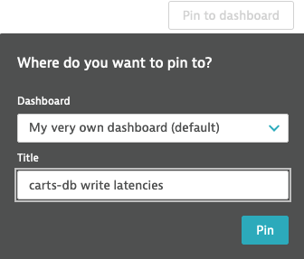
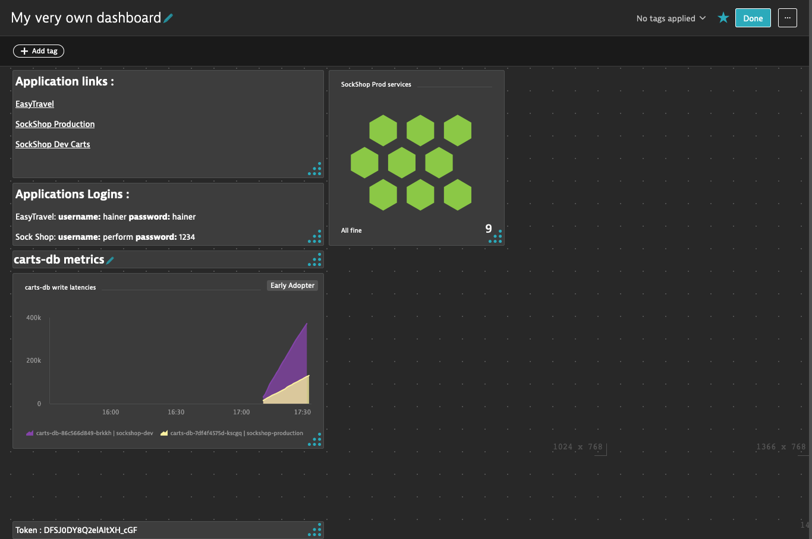
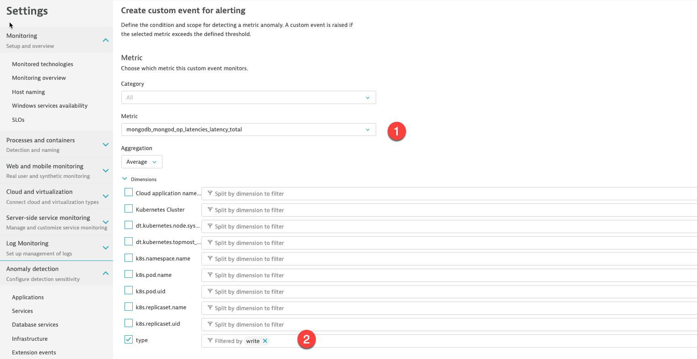
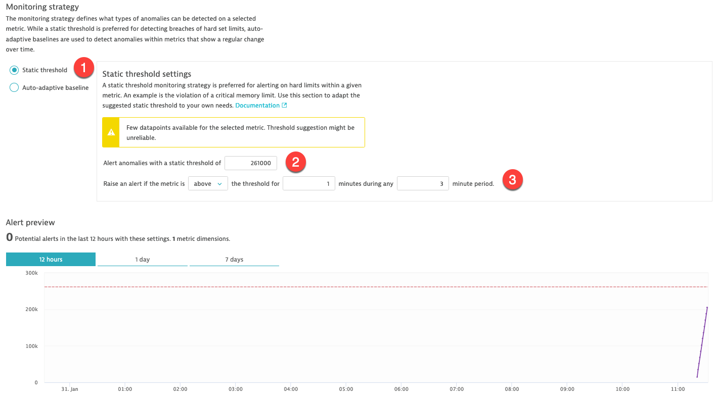
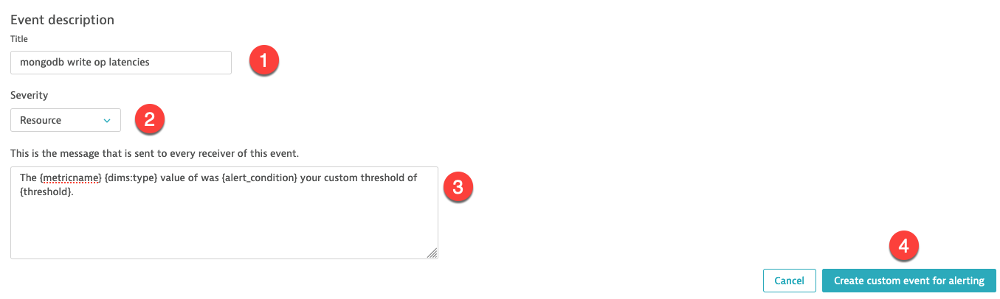
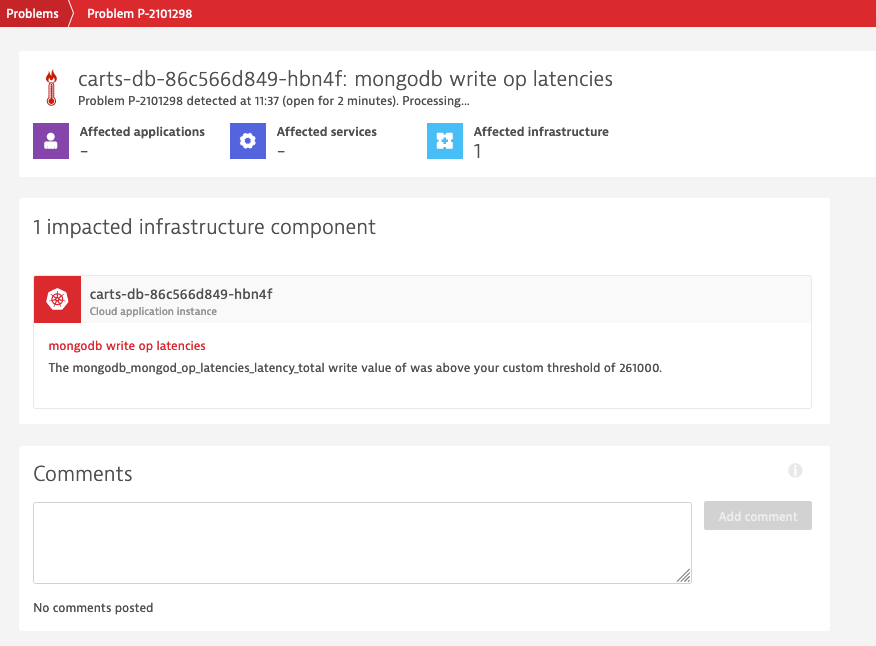

## Exercise #6 Import Prometheus Metrics

### Context

Our Sock Shop, EasyTravel and HipsterShop applications are using 3rd-party technologies, such as Nginx, Redis, RabbitMQ, MySQL and MongoDB, for which you need additional insights in terms of metrics.

Your researches found that metrics for those technologies, and many more, are available in Prometheus metrics format. So that seems a nice solution. There's a few drawbacks with that though: 

- You (or your monitoring team) need to deploy and maintain Prometheus as an additional monitoring tool, including all the necessary infrastructure
- You need to configure and maintain alerting rules in Prometheus 
- The metrics in Prometheus are not in context of the application, the services and their dependencies

Fortunately, Dynatrace provides you the ability to ingest those same Prometheus format metrics, bringing them in the larger context of the microservices and pods, and allowing for enhanced alerting with auto-adaptive baselining of these metrics.

And even better, Dynatrace will scrape the metrics at the source, so you don't even need a Prometheus server. 

In this exercise, we will show how you can bring in MongoDB metrics for the Sock Shop carts service data stores.

### The MongoDB Prometheus exporter

We will use the containerized version of the Percona MongoDB Prometheus exporter. The exporter exposes MongoDB metrics, in OpenMetrics (i.e. Prometheus) format, via HTTP(S) endpoints.

The image we will use is available on Docker Hub here: https://hub.docker.com/r/ssheehy/mongodb-exporter 

To scrape metrics from this exporter, Dynatrace uses a software component called an <i>ActiveGate</i>. Those of you already familiar with Dynatrace might know that, typically, <b>ActiveGates</b> are deployed on Linux or Windows machines, which means you would need extra infrastructure outside of your Kubernetes cluster... :unamused: 

But this is no longer necessary! :metal: You can now deploy an ActiveGate that will run in its own pod in Kubernetes. Actually, your cluster already have one deployed. Let's take a quick look.

- In the Dynatrace console, go in the <b>Kubernetes</b> view
- Select the `dynatrace` namespace in the workload section (make sure you are in a Management Zone that allow you to see it - `All` or `k8s-infra`)


This pod is not only able to scrape Prometheus metrics, it runs the Kubernetes API extension that collects the cluster and workload events and metrics populating the <b>Kubernetes</b> view! 

So we have an <b>ActiveGate</b>, now we need the exporter.

The MongoDB exporter can be deployed in different manners. It can be deployed via <i>Helm chart</i> and run in its own pod. It can also run as a <i>sidecar container</i> in the MongoDB pod. That's how we will deploy it.

If you have not already, load the class Github repo in your browser: https://github.com/steve-caron-dynatrace/dynatrace-k8s 

Browse to the `sockshop/manifests/scenarios`, and click on `carts-db-with-prometheus-exporter.yml`

In the pod template definition, you can see there are 2 containers defined. One for the MongoDB instance and another one for the exporter.


&nbsp;

Having the sidecar container is not sufficent. We must have the pod specifically annotated to tell the <b>Dynatrace ActiveGate</b> to scrape the metrics from its exposed endpoint.


Those annotations are sufficient. More annotations are available for configuration and specifying the metrics we want to capture (by default all metrics available are captured). For details, see the doc: https://www.dynatrace.com/support/help/shortlink/monitor-prometheus-metrics#annotate-prometheus-exporter-pods 

There are 2 mongodb deployments defined in this file, one for the production namespace and the other for the dev namespace. So we will get metrics from 2 different pods.

Let's apply this pod definition. Go to the web terminal, make sure you are in the `exercises` directory and execute the following command:

```sh
$ kubectl apply -f ../sockshop/manifests/scenarios/carts-db-with-prometheus-exporter.yml
```
This applies the new pod definition with the exporter as a side-car container. Let's validate the pods are running and ready.

```sh
$ kubectl get po -l name=carts-db --all-namespaces -w
```
Hit `ctrl-c` to exit the command


We see the dev pod has 2 containers, which corresponds to what is now expected. The production pod has an additional container, we will see why later on.

You will have to wait one or two minutes and then, in the Dynatrace console:

- Go in the new <b>Metrics</b> view
- In the filter text box, select `Text` and type `mongo`
- The MongoDB Prometheus metrics should be displayed
  - If you don't get anything, wait a bit more, refresh the screen and try again

 

- Remove the filter and this time try with the following : `mongodb_mongod_op_latencies_latency_total`


- Click on <b>Create chart</b>
- The measures displayed are an aggregation of the measure for each of the carts-db pods (dev and production)
  - In the <b>Split by</b> box, select:
    - `Cloud application instance` <b>(1)</b>
    - `Cloud application namespace` <b>(2)</b>
  - In the <b>Filter by</b> box, select: `type: write` <b>(3)</b>
    - The dimension `type` is a <i>Prometheus Label</i> (dimensions are called <i>labels</i> in Prometheus)
    - Selecting `write` will display the write operations latencies
  - Click on <b>Run query</b> <b>(4)</b>

&nbsp;


&nbsp;

- You can play with the chart mode <b>(5)</b> and the type of visualization
- <b>(6)</b> Once done, <b>Pin to dashboard</b>, select your very own personal dashboard, give a name to the chart : `carts-db write latencies`



- Click <b>Open Dashboard</b>

We are going to make a few cosmetic changes.

- Click the <b>Edit</b> button
- Drag a <b>Header</b> tile (from the toolbox at the right) and place it under the <b>Application Logins</b> tile.
- We will put a descriptive text in the header, such as `carts-db metrics`. Don't forget to click on the check mark.
- Resize the tile so it has the same width as the tile above.
- Drag the `carts-db write latencies` tile you just imported under the header tile and resize it.
- The result should roughly look like this:

&nbsp;



&nbsp;

- DON'T FORGET to click the <b>Done</b> button once you're happy with the result.

&nbsp;

### How to get custom alerts based on that metric?

Now you have access to MongoDB Prometheus metrics in Dynatrace. Even though they come from a 3rd party, those metrics are now first class citizens in Dynatrace. We have already seen that you can visualize those metrics in charts and dashboards all the same as Dynatrace-native metrics.

But, of course, you don't want to spend your days looking at dashboards. What you want is to be notified if there's an anomaly related to the metrics you are capturing.

We will define a custom <b>Anomaly Detection</b> rule for your metric, using a fixed threshold. DAVIS, the Dynatrace AI, can automatically baseline the metric but in the context of this workshop, it will be easier to obtain an alert if we used a fixed threshold. Also, not all metrics lend well to auto-baselining; it depends on the metric variation pattern.

- Go to <b>Menu -> Settings -> Anomaly Detection -> Custom events for alerting</b>
- Click on <b>Create custom event for alerting</b>
- In the metric drop-down box <b>(1)</b>, enter (copy-paste): `mongodb_mongod_op_latencies_latency_total`
- Specify the following dimensions and values <b>(2)</b>:
  - type : `write`

&nbsp;



&nbsp;

- In the <b>Monitoring strategy section</b>, select `Static threshold` <b>(1)</b>
  - Use the suggested static thresold or a lower value; we want this alert to trigger within a short amount of time. <b>(2)</b>
- Raise alert if the metric is `above` the threshold for `1` minutes during any `3` minute period. <b>(3)</b>

&nbsp;



&nbsp;

- In the <b>Event description</b> section, enter a title: `mongodb write op latencies` <b>(1)</b>
- Change the severity to `Resource` <b>(2)</b>
- In the message text box, you can enter free text and properties using brackets { }.
  - Enter: `The {metricname} {dims:type} value of was {alert_condition} your custom threshold of {threshold}.` <b>(3)</b>
- Click on <b>Create custom event for alerting</b> <b>(4)</b>

&nbsp;

&nbsp;

You're done! Now it's just a matter of time before an alert is triggered (normally within 5 to 10 minutes depending on the threshold you set).



---

[Previous : #7 : Deploy a Canary](../07_Deploy_a_Canary/README.md) :arrow_backward: :arrow_forward: [Next : #9 : Manage your Workload Resource Usage](../09_Manage_Workload_Resource_Usage/README.md)

:arrow_up_small: [Back to overview](../README.md)
