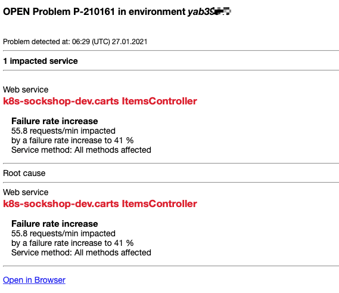

## Exercise #09 Problem detection

## Meanwhile...

<u>Scenario</u>: Projects are moving fast within the company.

The Sock Shop product management has been planning a revamp of the shopping cart technology. The line of business has been promoting this project internally, which caught executive eyeballs. So much that the new <b>carts</b> service development was fast-tracked and there is a huge pressure to push it in production.

The day for the release of the new <b>carts</b> service is coming soon, everyone's excited... :partying_face:
... except the dev team who is concerned by the quality, as there was no time test properly. :cold_sweat: 

But you managed to win your point and negociate a bit of time to do some testing! 


Will that make a difference? Well, now that you have Dynatrace, let's see how it can help!


### Deploy new carts build in dev

Also, in parallel, there are changes coming again to the <b>carts</b> services. The dev team is working on some new feature for marketing.

In the web terminal (make sure you are in the `exercises` directory), execute the following command to deploy the new <b>carts</b> build in dev:

```sh
$ kubectl apply -f ../sockshop/manifests/scenarios/carts-dev-new-build.yml
```
The <b>carts</b> pod takes about 5 minutes to be ready.

<b><u>TIME FOR A QUICK BREAK!</u></b>


## All is well?

<u>Keep an eye on your email inbox for the next few minutes</u>. You should receive something from the "Dynatrace team".



Or, if you did not set up the email configuration, keep an eye at the Dynatrace console. At some point, a number highlighted in red will show up in the top right corner.

Also, you can go in the Menu -> <b>Problems</b>. You will see a blue header offering to try the new problem feed. Click on <b>Try it out</b>.


- <b>(1)</b> Filter by your <b>Alerting profile</b> : `sockshop carts dev`
- <b>(2)</b> Click on `Response time degradation`

You will get to the <b>Problem ticket</b> produced by the Dynatrace DAVIS AI.

Problem tickets provides you the entire context of the issue, including impact and root causing pinpointing what needs to be done to solve it.


In the <b>Root cause</b> analysis section, for the `k8s-sockshop-dev.carts ItemsController</b> service, click on the <b>Analyze response time degration<b>.


This view shows provides you an analysis of how and where the service response time is degrading.

We can see it is not during interaction with other services or queues, neither it is spent on database calls. The time is spent inside the service, in <b>Active wait time</b> <b>(1)</b>.

OK, so what? What should I tell my devs to do. I've got the CIO breathing down my neck; that's got to be fixed quickly.

Well, Dynatrace can lead you deeper, down to code-level. Click on <b>View method hotspots</b>. <b>(2)</b>

[carts-dev-method-hotspots](../../assets/images/carts-dev-method-hotspots.png)

This view shows how much time the `ItemsController` service spent executing its own code.

- Click on <b>Hotspots</b> <b>1</b> to switch to the top contributors methods. 
- We see `Thread.sleep` as the top contributor... by far... Click on it. <b>(2)</b>
- The <b>Call tree</b> section displays all the classes and methods that were executed and how much they contribute to the overall execution. This allows you to identify which class and/or method is consuming most of the execution time and subsequently optimize the code.

All right! That's actionable info your developers can use to fix their code. You could even copy-paste this page URL so your developers don't have to click around. All Dynatrace links are <i>permalinks</i>.

That means this build is defective and you need to rollback to `Revision 1`

In the web terminal, execute:

```sh
$ kubectl rollout undo deployments carts --to-revision=1 -n sockshop-dev
```

Eventually, you will receive an email notifying you that the problem is resolved.

---

[Previous : #9 Configure k8s cluster monitoring integration](../09_Configure_k8s_cluster_monitoring_integration) :arrow_backward: 

:arrow_up_small: [Back to overview](../)