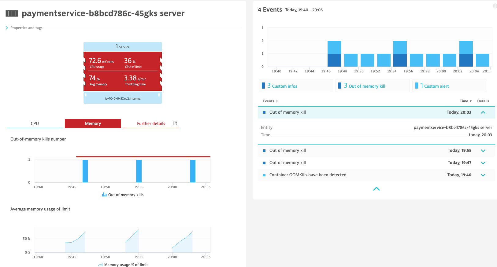

## Exercise #10 Managing your workload resource usage

### There ain't such thing as a free lunch 

It's not because you are running your workload on such a hot and sophisticated platform as Kubernetes that the laws of nature are not applied.

The Kubernetes platform is built on a number of virtualization and abstraction layers but at the bottom, there are still good old bare-metals machines, whether they are hosted by your company, in a co-location data center or managed by a public cloud service provider.

The point here is that you still need to be conscious of the resources that your workload is using. Because Kubernetes is a platform running on shared infrastructure, how much resources you use might affect the other applications running on the same cluster.

This is why the Kubernetes platform administrators will typically set resource quotas that will be granted to your project (namespace). As an application team, it is your responsibility to assign the given resources to your different microservices.

### If memory serves

The <b>Hipster Shop</b> team has just deployed a new release of the `paymentservice`, which is developed in nodejs. As you can imagine, this is an <ins>important</ins> service for the line of business. :smirk:  

In the web terminal (make sure you are in the `exercises` directory), execute:

```sh
$ kubectl apply -f ../hipstershop/paymentservice-new.yaml
```
In the mean time, we'll look at how Kubernetes workload resource management works.

Keep an eye on your Dynatrace console... you never know what could happen. :monocle_face:

At some point, both the Hipster Shop and the k8s infra teams received an alert from Dynatrace. Let's take a look at it.


The container from the new `paymentservice` pod has been OOMKilled. This means its memory usage went above its configured limit.

- Click on the container to drill-down the the <b>Containers</b> view.



This means its memory usage went above its configured limit (which is 128Mi). The thing is, before today, you never had any OOMKilled problem with `paymentservice`. 

So it has something to do with the new build. Either:

- The new build now requires more memory to be able to work properly. In that case you need to increase the memory limit for the container... and potentially negociate higher resource quota with the Kubernetes platform ops team.
  - Test with multiple limit values and monitor the container memory consumption with Dynatrace (<b>Container</b> view or build a custom dashboard)
- The new build has a memory leak, which over time makes it consume memory above the limit.
  - If that is the case, whatever the increase in memory limit, it will eventually be breached. You would just be buying time, the code itself needs to be fixed.
  - Test under different conditions and monitor nodejs metrics (in the <b>Process</b> view). Dynatrace will provide you all the metrics you need. Make code corrections and test again. Wash-rinse-repeat. :upside_down_face:
  - Dynatrace can also help you further by collecting nodeJS V8 engine memory dumps on demand for analysis. This is beyond the scope of this workshop but if you are interested, you can find more information [here](https://www.dynatrace.com/support/help/shortlink/memory-dumps).

  

### What else could go wrong?

So your dev team quickly found the issue and provided a fix that you are hastily deploying.

In the web terminal (`exercises` directory please), execute:

```sh
$ kubectl apply -f ../hipstershop/paymentservice-fix.yaml
```

You need a coffee (or whatever other choice of beverage). You're not even back to your computer that you have received an alert from Dynatrace on your smartphone.

Take a look in the Dynatrace console.


What? Why is this pod in `pending` state? This means the pod is not `ready` and it cannot serve requests. The pod with the memory issue is still there and will continue to serve requests until the new pod becomes `ready`.

This is an example of a difficult problem to spot if you don't have visibity into Kubernetes events and object states. Application-level monitoring will not show any problem until maybe the next `OOMkill`, because the service is still available. You assume the fixed version is deployed but it's not.

You can also see that in the <b>Kubernetes -> Workload namespaces -> hipster-shop</b> view.


And if you look to the Kubernetes cluster events (in the previous screen), you will see why the pod is pending. Filter for `Back-Off` events.


As you can see, the pod is in pending state because the new container image specified in the deployment manifest could not be pulled from the container image registry. You can see the image tag in the message : `paymentservice:999999-image-tag-not-on-the-registry`. A quick look at the registry and indeed, it's never been pushed there.

You might say, how can this happen? Images are automatically built and pushed to the registry by our CI/CD pipelines. Well, there is a thing such as "Murphy's Law". Whatever can potentially go wrong will eventually go wrong.

&nbsp;


&nbsp;

But this does not mean your already difficult day needs to be more miserable. Once again, Dynatrace quickly spotted the issue and gave you the info you need to fix it!

In the terminal, push the new build that you made sure the image has been pushed to the registry.

```sh
$ kubectl apply -f ../hipstershop/paymentservice-fix-the-fix.yaml
```

The open problem in Dynatrace will automatically close itself.

### Meanwhile, on the EasyTravel front...

We haven't talked much about EasyTravel but their dev team have been busy, trying to break down that big ball of mud into microservices.

There's a new build for the `easytravel-backend` pod available, so we'll deploy it.

In the web terminal, execute:

```sh
$ ./toggle-easytravel-resources-scenario-1.sh
```

At the prompt, enter `1` to enable the scenario.

You leave your computer for a quick snack. You receive a call from the k8s infra team. They have a problem with the cluster and it's the fault of EasyTravel! 

They sent you a few screenshots. You can do the navigation yourself if you want.

In the Dynatrace console, go in the <b>Kubernetes</b> view.


This tells you:

- <b>(1)</b> One of the 3 cluster nodes is in problem
- <b>(2)</b> The CPU usage on at least one of the cluster nodes has increased to around 98% 
- <b>(3)</b> Which of the nodes is in problem

You can click on <b>Analyze nodes</b> to get a more detailed view of the nodes resource usage.

We will drill-down to the node underlying <b>Host</b> view, where we have a confirmation (from OS-level metrics) of the CPU saturation.


But what is causing that saturation? Click on <b>Consuming processes</b> to have a breakdown by </b>Process</b>.


&nbsp;

Looks like the culprit is easytravel backend Java process, which is consuming 88% of the host CPU... :unamused:

You can also see that in the <b>Workloads</b> view : <b>Menu -> Kubernetes -> Namespaces -> easytravel</b>

&nbsp;


We can see in this view the `easytravel-backend` pod is using a whopping <u>3.51</u> cores!!! Compare with the other pods using less than 100 <i>milli</i>cores.

How could this happen? Well, historically, EasyTravel has been a monolithic app that has been lifted and shifted to run in Docker containers and eventually moved to Kubernetes. The plan is to re-architect the app into microservices but it's easier said than done. Because of that, it never followed proper Kubernetes best practices and there are no resource limits defined for the workload.

In light of this, in order to protect the cluster (which is also hosting <b>Sock Shop</b> and <b>HipsterShop</b> workloads), the k8s infra team decided to impose a resource quota on the `easytravel` namespace.

In the web terminal, execute:

```sh
$ kubectl apply -f  ../easytravel/compute-resources-quota.yaml 
```
And you will also bounce the `easytravel-backend` pod so it picks up on this new resource quota.

```sh
kubectl delete po -l app=easytravel-backend -n easytravel
```

Assuming all will be good from now on...

So our problem here is that our EasyTravel pods don't have resource requests and limits. With resource quota now imposed on the namespace, any pod that don't have CPU and Memory requests and limits configured will not be scheduled to be deployed on any of the cluster node. This is the Kubernetes cluster protecting itself. Those k8s platform admins! :angry:

You bounced the `easytravel-backend` to revert to the stable version but it was never scheduled to run because there's no request and limit set.

And the `easytravel-frontend` and `easytravel-www` pods rely on the backend for their liveness probe so they also, in a cascade of failures, went down, resulting in the web site becoming unavailable. 


Good thing that have a <b>Synthetic Monitor</b> set up to detect this before too many customers are impacted. Imagine the reaction of the Customer Service department. :sweat: 

In order to set the proper requests and limits you need to understand the usage of your workload. How? Well, remember Dynatrace is capturing all those metrics. So you just need to analyze those over time in under different load patterns.

But for now, you need EasyTravel back up and running asap. So you will use a <i>Limit Range</i> definition for the `easytravel` namespace. What it does is define default CPU and Memory requests and limits for deployments that don't have those request/limits specifically configured in each of their definition.

In the web terminal, execute:

```sh
$ kubectl apply -f ../easytravel/compute-limitrange.yaml
$ kubectl delete rs -l app=easytravel-backend -n easytravel
$ kubectl get po -n easytravel -w
```
To make things faster, we're deleting the replicaset to force a new one and precede the pod scheduling. Also, the last command will display the pods and watch for updates. You should see the `easytravel-backend` pod back on. Press `Ctrl-c` to exit.

### Such a perfect day

After all this stress, you are thinking of maybe taking a walk or a nap, or doing some meditation. But...

You are receiving distress calls from the EasyTravel team. Seems the application performance degraded significantly...  

Take a look at the <b>Problems</b> feed in your Dynatrace console.


What more? 

- Aside from the multiple service <b>slowdown</b> problems detected by DAVIS, you spot a <b>resource</b> problem : <b>Container CPU throttle</b> impacting the `easytravel-backend` container.
- Click on that container.


You can see the `easytravel-backend` is being heavily CPU throttled!!! What this means is that it is trying to consume way more CPU than its configured limit (which is provided by the namespace <b>LimitRange</b> in this case). And Kubernetes is throttling (limiting) this container CPU consumption which has a cascading slowdown impact on the code execution of the Java process running in the container.

To give you a perspective of how high is the throttling, here is a view of the CPU throttling for all the workloads in the `easytravel` namespace. You see the difference?


All right, that's enough for today! You ask the EasyTravel team to rollback the backend pod to its previous, more stable version and do some investigation regarding the CPU consumption. But that will be for another day.

```sh
$ ./toggle-easytravel-resources-scenario-1.sh
```
At the prompt, enter `2` to disable the scenario. The problems in Dynatrace will eventually be automatically closed.

You learned the hard way the importance of resource management in Kubernetes. There's no magic here. Resources will always be limited and associated to a cost, either in infrastructure or cloud services.

You need to get a solid and accurate picture of your workload resource consumption in order to figure out what requests and limits you have to set for your different services. 

Also, the k8s infra ops team will always give you only the amount of resources you need. It is their responsiblity to make sure the platform stays healthy for everyone using it. So in the case you need more resources, you have to enter into a negociation with the platform team. And as with any negociation, it's always better if you come at the table with as much information you can get. 

And you can count on Dynatrace for that!

---

[Previous : #8 : Import Prometheus Metrics](../08_Import_Prometheus_Metrics/README.md) :arrow_backward: 

:arrow_up_small: [Back to overview](../README.md)